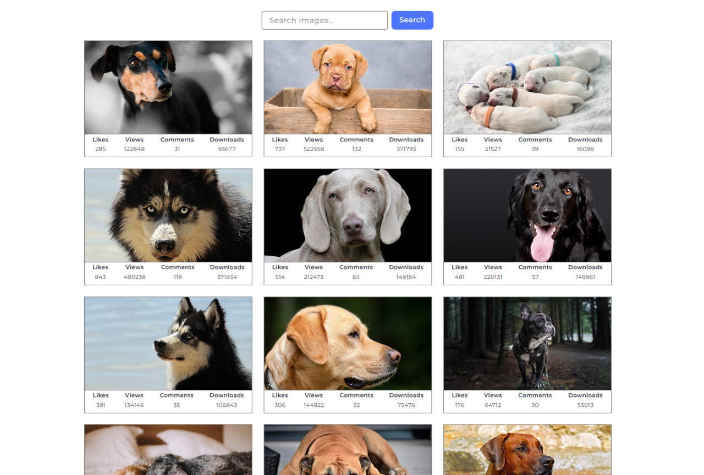

# REST API Integration: Async/Await, Axios & Pagination

**🌐 Language:** **English** · [Українська](./README.ua.md) ·
[Русский](./README.ru.md) · [Español](./README.es.md) ·
[العربية](./README.ar.md)


> A practical demonstration of **modern client-server interaction**: consuming a
> public REST API with Axios, handling asynchronous flows via `async/await`,
> implementing pagination, and structuring the codebase with a clear separation
> of concerns between data, view, and controller layers.

🔗 **Live demo:**
[mrkorzun.github.io/pixabay-image-search](https://mrkorzun.github.io/pixabay-image-search/)



---

## 🎯 What This Project Demonstrates

An image search application built on top of the **Pixabay REST API**. The user
enters a keyword, the app fetches photos from a real third-party service,
paginates the results via a "Load more" button, and lets users preview full-size
images in a lightbox. Beyond the visible features, the project is structured
around **production-style patterns** — modular file architecture, dedicated API
layer, view layer, and a controller that wires them together.

| Layer                                  | Responsibility                                |
| -------------------------------------- | --------------------------------------------- |
| **API layer** (`pixabay-api.js`)       | All HTTP communication with Pixabay           |
| **View layer** (`render-functions.js`) | DOM rendering, gallery state, lightbox        |
| **Controller** (`main.js`)             | Business logic, event handling, orchestration |

This is the same separation you'd see in any framework-driven app — implemented
here in vanilla JS to prove the fundamentals are solid.

---

## 💡 Skills & Competencies

### 🔹 REST API Consumption

- Working with a real public API (**Pixabay**) — reading docs, building query
  strings, handling responses.
- Required query parameters: `key`, `q`, `image_type`, `orientation`,
  `safesearch`, `per_page`, `page`.
- Parsing structured JSON responses and extracting only the fields the UI
  actually needs.
- Defensive handling of `totalHits` to detect end-of-collection.

### 🔹 HTTP Client — Axios

- **Axios** as the HTTP layer instead of raw `fetch` — automatic JSON parsing,
  cleaner error semantics.
- Request configuration via `params` object (no manual query-string building).
- Centralized API access through a single exported function — the rest of the
  app never touches Axios directly.

### 🔹 Asynchronous JavaScript — async/await

- Refactor of an earlier `.then()/.catch()` implementation into modern
  **async/await** syntax.
- `try/catch/finally` blocks for clean error handling and guaranteed loader
  teardown.
- Awareness of the trade-off: `async/await` reads top-to-bottom, but you still
  need to handle rejections explicitly.

### 🔹 Pagination Pattern

- Page counter (`page`) tracked in module-level state.
- Reset to `1` on every new search query — never paginate stale results.
- "Load more" button increments the page and appends new cards instead of
  replacing them.
- End-of-collection detection via `totalHits` with a user-facing message.

### 🔹 Modular Architecture

- **Separation of concerns**: API (data), render (view), main (controller).
- ES Modules with explicit `import`/`export` — no globals, no implicit
  dependencies.
- Each module has a single responsibility and a clear public API.

### 🔹 UX Polish

- **Loader** during requests — UI never feels frozen.
- **Smooth scroll** via `window.scrollBy` after each "Load more" —
  auto-positions the user on freshly loaded cards.
- **iziToast** for empty results, errors, and end-of-collection — no native
  `alert()` anywhere.
- **SimpleLightbox** for full-size image preview with `lightbox.refresh()` after
  each render.

### 🔹 Build Tooling & Workflow

- **Vite** as a dev server and bundler with HMR.
- **GitHub Pages** auto-deployment via GitHub Actions (`.github/workflows`).
- **Prettier** + **EditorConfig** for consistent formatting.
- **Git** with descriptive, atomic commits.

---

## 🧩 Feature Walkthrough

### REST API Integration

A single `getImagesByQuery(query, page)` function encapsulates **all**
communication with Pixabay. The rest of the app calls this one function and
trusts its return value — the controller doesn't know or care that Axios exists.
This is the foundation of testable, replaceable, and maintainable API code.

```js
import axios from 'axios';

const BASE_URL = 'https://pixabay.com/api/';
const API_KEY = import.meta.env.VITE_PIXABAY_API_KEY;

export async function getImagesByQuery(query, page) {
  const { data } = await axios.get(BASE_URL, {
    params: {
      key: API_KEY,
      q: query,
      image_type: 'photo',
      orientation: 'horizontal',
      safesearch: true,
      per_page: 15,
      page,
    },
  });
  return data;
}
```

---

### Async/Await Control Flow

The submit handler tells the full story of one request lifecycle: clear the
previous state, show the loader, fetch, render, manage the load-more button —
and clean up the loader no matter what happens. The `try/catch/finally` block
guarantees the UI never gets stuck in a loading state, even if the network
fails.

```js
form.addEventListener('submit', async e => {
  e.preventDefault();
  query = e.target.elements.searchQuery.value.trim();
  page = 1;

  if (!query) return;

  clearGallery();
  hideLoadMoreButton();
  showLoader();

  try {
    const { hits, totalHits } = await getImagesByQuery(query, page);

    if (!hits.length) {
      iziToast.error({
        message:
          'Sorry, there are no images matching your search query. Please try again!',
      });
      return;
    }

    createGallery(hits);
    if (page * 15 < totalHits) showLoadMoreButton();
  } catch (error) {
    iziToast.error({ message: `Request failed: ${error.message}` });
  } finally {
    hideLoader();
  }
});
```

---

### Pagination via "Load More"

The pagination logic is deliberately simple but covers every edge case: the page
counter is reset on every new search; new pages are **appended**, not replacing
the gallery; when the last page is reached, the button hides itself and the user
sees an end-of-results message. After each load, `window.scrollBy` smoothly
nudges the page so users immediately see the new content.

```js
loadMoreBtn.addEventListener('click', async () => {
  page += 1;
  showLoader();
  try {
    const { hits, totalHits } = await getImagesByQuery(query, page);
    createGallery(hits);

    // Smooth scroll by exactly two card heights
    const { height } = document
      .querySelector('.gallery-item')
      .getBoundingClientRect();
    window.scrollBy({ top: height * 2, behavior: 'smooth' });

    if (page * 15 >= totalHits) {
      hideLoadMoreButton();
      iziToast.info({
        message: "We're sorry, but you've reached the end of search results.",
      });
    }
  } finally {
    hideLoader();
  }
});
```

---

## 🚀 Running Locally

```bash
git clone https://github.com/mrkorzun/pixabay-image-search.git
cd pixabay-image-search
npm install
npm run dev
```

> **Note:** This project requires a Pixabay API key. Get one for free at
> [pixabay.com/api/docs](https://pixabay.com/api/docs/) and add it to a `.env`
> file as `VITE_PIXABAY_API_KEY=your_key_here`.

The dev server will print a local URL (usually `http://localhost:5173`).

### Production build

```bash
npm run build       # builds into ./dist
npm run preview     # serves the production build locally
npm run deploy      # publishes to GitHub Pages
```

---

## 📁 Project Structure

```
pixabay-image-search/
├── .github/workflows/       # CI/CD for GitHub Pages deployment
├── src/
│   ├── js/
│   │   ├── pixabay-api.js       # API layer — Axios calls
│   │   └── render-functions.js  # View layer — DOM rendering & lightbox
│   ├── css/
│   │   └── styles.css
│   └── main.js                  # Controller — business logic
├── index.html
├── .editorconfig
├── .prettierrc.json
├── package.json
├── vite.config.js
└── README.md
```

---

## 👤 Author

**Romario Korzun** — Front-End Developer

- GitHub: [@mrkorzun](https://github.com/mrkorzun)
- Portfolio: [mrkorzun.github.io](https://mrkorzun.github.io)

---

<sub>Originally built as a practical exercise within the **GoIT JavaScript**
curriculum, expanding on an earlier image-search project to consolidate
experience with REST APIs, async/await, and pagination patterns.</sub>
